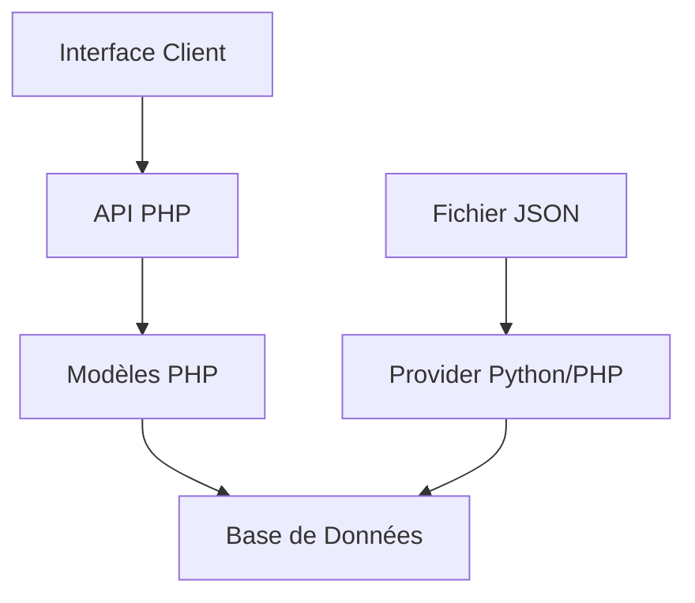

# IUTables'O - Guide Complet

## 📋 Table des matières

1. [Vue d'ensemble](#vue-densemble)
2. [Prérequis et Installation](#prérequis-et-installation)
3. [Configuration de la Base de Données](#configuration-de-la-base-de-données)
4. [Chargement des Données](#chargement-des-données)
5. [Guide d'Utilisation](#guide-dutilisation)
6. [Architecture du Projet](#architecture-du-projet)
7. [Documentation API](#documentation-api)
---

## 🎯 Vue d'ensemble

**IUTables'O** est une application web moderne dédiée à la découverte et à l'évaluation des restaurants d'Orléans. Cette plateforme offre une expérience utilisateur complète avec des fonctionnalités avancées de géolocalisation, de gestion des favoris et d'évaluation collaborative.

### 🚀 Fonctionnalités principales

- **Interface responsive** avec Bootstrap 5
- **Carte interactive** utilisant OpenStreetMap et Leaflet
- **Système d'authentification** sécurisé avec sessions PHP
- **Gestion des favoris** en temps réel
- **Système de notation** et commentaires
- **Pagination infinie** pour une navigation fluide
- **API RESTful** complète pour l'intégration

### 👥 Types d'utilisateurs

- **🔍 Visiteurs** : Consultation libre des restaurants et avis
- **👤 Utilisateurs authentifiés** : Gestion complète des favoris, avis et profil

---

## ⚙️ Prérequis et Installation

### 📋 Prérequis techniques

- **PHP** 8.0 ou supérieur
- **Python** 3.8+ (pour le provider de données)
- **Serveur web** (Apache, Nginx, ou serveur intégré PHP)
- **Base de données** PostgreSQL (compatible avec toute base de données relationnelle)
- **Navigateur moderne** supportant ES6+

### 🛠️ Installation

1. **Clonage du projet**

   ```bash
   git clone https://github.com/votre-repo/SAE_PHP.git
   cd SAE_PHP
   ```

2. **Vérification des dépendances**

   ```bash
   php --version  # Vérifier PHP 8.0+
   python3 --version  # Vérifier Python 3.8+
   ```

3. **Démarrage du serveur de développement**

   ```bash
   php -S localhost:8000
   ```

4. **Accès à l'application**
   ```
   http://localhost:8000/front-end/index.html
   ```

---

## 🗄️ Configuration de la Base de Données

### Configuration Supabase (Recommandée)

1. **Créer un projet Supabase**

   - Rendez-vous sur [supabase.com](https://supabase.com)
   - Créez un nouveau projet
   - Notez les informations de connexion

2. **Configuration dans SupabaseLoader.php**
   ```php
   // filepath: /home/rocma/Downloads/SAE_PHP-main/class/db/SupabaseLoader.php
   class SupabaseLoader {
       public static function getConnection(): PDO {
           $password = 'VOTRE_MOT_DE_PASSE';
           $host = 'VOTRE_HOST_SUPABASE';
           $port = '5432';
           $dbname = 'postgres';
           $user = 'postgres';

           // ...existing code...
       }
   }
   ```

### ⚠️ Important : Compatibilité Multi-SGBD

Le projet est conçu pour être **compatible avec tout système de gestion de base de données relationnelle**. Pour utiliser une autre base de données :

- **MySQL/MariaDB** : Modifiez le DSN en `mysql:host=$host;dbname=$dbname`
- **SQLite** : Utilisez `sqlite:/path/to/database.db`
- **PostgreSQL local** : Configurez vos paramètres locaux

### 📊 Structure de la base de données

```sql
-- Tables principales
CREATE TABLE utilisateur (
    id SERIAL PRIMARY KEY,
    nom VARCHAR(100),
    prenom VARCHAR(100),
    mail VARCHAR(255) UNIQUE,
    mdp VARCHAR(255),
    telephone VARCHAR(20)
);

CREATE TABLE restaurant (
    id SERIAL PRIMARY KEY,
    name VARCHAR(255),
    cuisine TEXT[],
    geo_point_2d JSONB,
    geo_shape JSONB,
    -- ... autres champs
);

CREATE TABLE avis (
    id SERIAL PRIMARY KEY,
    "idU" INTEGER REFERENCES utilisateur(id),
    "idR" INTEGER REFERENCES restaurant(id),
    note INTEGER CHECK (note >= 1 AND note <= 5),
    critique TEXT
);

CREATE TABLE aime (
    id SERIAL PRIMARY KEY,
    "idU" INTEGER REFERENCES utilisateur(id),
    "idR" INTEGER REFERENCES restaurant(id)
);
```

---

## 📤 Chargement des Données

### 🐍 Provider Python (Recommandé)

Le projet inclut un **provider Python performant** pour le chargement en masse des données :

```bash
cd loadjson
python3 load.py
```

**Avantages du provider Python :**

- ⚡ **Performance optimisée** pour les gros volumes
- 🛡️ **Gestion robuste des erreurs**
- 📊 **Rapport détaillé** du chargement
- 🔄 **Support des mises à jour incrémentales**

### 🐘 Provider PHP (Alternative)

Pour un chargement simple via PHP :

```bash
php provider.php
```

### 📋 Format des données

Le fichier [`restaurants_orleans.json`](loadjson/restaurants_orleans.json) contient les données OpenStreetMap structurées :

```json
{
  "name": "Restaurant Example",
  "cuisine": ["française", "traditionnelle"],
  "geo_point_2d": [47.9029, 1.9093],
  "geo_shape": {
    "type": "Point",
    "coordinates": [1.9093, 47.9029]
  },
  "opening_hours": "Mo-Su 12:00-14:00,19:00-22:00"
}
```

---

## 📱 Guide d'Utilisation

### 🏠 Page d'Accueil (`index.html`)

**Interface visiteur :**

- **Navigation intuitive** avec barre de recherche
- **Cartes restaurant** avec badges de cuisine
- **Pagination infinie** au scroll
- **Accès direct** aux détails

**Fonctionnalités connectées :**

- **Icônes favoris** (❤️) interactives
- **Statut de connexion** dans la navigation
- **Accès profil** personnalisé

### 🔐 Authentification

#### Inscription (`register.html`)

```javascript
// Workflow d'inscription
1. Saisie des informations (prénom, nom, email, mot de passe, téléphone)
2. Validation côté client et serveur
3. Création du compte via API
4. Redirection automatique vers la connexion
```

#### Connexion (`login.html`)

```javascript
// Workflow de connexion
1. Saisie email/mot de passe
2. Authentification via session PHP
3. Redirection vers l'accueil
4. Mise à jour de l'interface utilisateur
```

### 🍽️ Détails Restaurant (`restaurant-details.html`)

**Informations affichées :**

- **Nom et badges** de type de cuisine
- **Note moyenne** calculée dynamiquement
- **Carte interactive** avec marqueur précis
- **Liste des avis** avec système d'étoiles

**Fonctionnalités interactives :**

- **Ajout/suppression favoris** en un clic
- **Formulaire d'avis** pour utilisateurs connectés
- **Modification d'avis** existants
- **Géolocalisation** sur carte OpenStreetMap

### 👤 Gestion de Profil (`profile.html`)

**Section Informations personnelles :**

- Modification prénom, nom, email
- Changement de mot de passe
- Mise à jour téléphone
- Sauvegarde temps réel

**Section Favoris :**

- Liste complète des restaurants favoris
- Accès rapide aux détails
- Suppression directe possible

---

## 🏗️ Architecture du Projet

### 📁 Structure des fichiers

```
SAE_PHP-main/
├── 📄 README.md                 # Documentation complète
├── 🔧 AutoLoader.php            # Chargement automatique des classes
├── 📊 provider.php              # Provider PHP de données
├──
├── 🌐 api/                      # API RESTful endpoints
│   ├── 🍽️ restaurant.php       # CRUD restaurants
│   ├── 👤 user.php              # Gestion utilisateurs
│   ├── ⭐ avis.php              # Système d'avis
│   ├── ❤️ aime.php              # Gestion favoris
│   └── 🔐 auth.php              # Authentification
│
├── 🏛️ class/db/                 # Couche d'accès aux données
│   ├── 🍽️ Restaurant.php       # Modèle restaurant
│   ├── 👤 User.php              # Modèle utilisateur
│   ├── ⭐ Avis.php              # Modèle avis
│   ├── ❤️ Aime.php              # Modèle favoris
│   └── 🗄️ SupabaseLoader.php   # Connexion base de données
│
├── 🎨 front-end/               # Interface utilisateur
│   ├── 🏠 index.html           # Page d'accueil
│   ├── 🔐 login.html           # Connexion
│   ├── 📝 register.html        # Inscription
│   ├── 👤 profile.html         # Profil utilisateur
│   ├── 🍽️ restaurant-details.html # Détails restaurant
│   ├── 🎨 css/style.css        # Styles personnalisés
│   └── ⚡ js/app.js            # Logique client
│
└── 📊 loadjson/                # Données et providers
    ├── 🐍 load.py              # Provider Python (performant)
    └── 📋 restaurants_orleans.json # Données restaurants
```

### 🔄 Flux de données



---

## 🔌 Documentation API

### 🍽️ Restaurants

| Méthode  | Endpoint                      | Description                | Paramètres                      |
| -------- | ----------------------------- | -------------------------- | ------------------------------- |
| `GET`    | `/api/restaurant.php`         | Liste tous les restaurants | `page`, `limit` pour pagination |
| `GET`    | `/api/restaurant.php?id={id}` | Détails d'un restaurant    | `id` : Identifiant restaurant   |
| `POST`   | `/api/restaurant.php`         | Création restaurant        | Body JSON avec données          |
| `PUT`    | `/api/restaurant.php?id={id}` | Mise à jour restaurant     | `id` + Body JSON                |
| `DELETE` | `/api/restaurant.php?id={id}` | Suppression restaurant     | `id` : Identifiant              |

### 👤 Utilisateurs

| Méthode  | Endpoint                | Description        | Authentification |
| -------- | ----------------------- | ------------------ | ---------------- |
| `GET`    | `/api/user.php`         | Liste utilisateurs | Optionnelle      |
| `GET`    | `/api/user.php?id={id}` | Profil utilisateur | Optionnelle      |
| `POST`   | `/api/user.php`         | Création compte    | Non requise      |
| `PUT`    | `/api/user.php?id={id}` | Mise à jour profil | Requise          |
| `DELETE` | `/api/user.php?id={id}` | Suppression compte | Requise          |

### ⭐ Avis et Favoris

| Méthode  | Endpoint                 | Description         | Session requise |
| -------- | ------------------------ | ------------------- | --------------- |
| `GET`    | `/api/avis.php?idR={id}` | Avis restaurant     | Non             |
| `POST`   | `/api/avis.php`          | Nouvel avis         | Oui             |
| `GET`    | `/api/aime.php?idU={id}` | Favoris utilisateur | Oui             |
| `POST`   | `/api/aime.php`          | Ajouter favori      | Oui             |
| `DELETE` | `/api/aime.php`          | Supprimer favori    | Oui             |

### 🔐 Authentification

| Endpoint                               | Action      | Retour              |
| -------------------------------------- | ----------- | ------------------- |
| `POST /api/auth.php?action=register`   | Inscription | `{id, message}`     |
| `POST /api/auth.php?action=login`      | Connexion   | `{message, user}`   |
| `POST /api/auth.php?action=logout`     | Déconnexion | `{message}`         |
| `GET /api/auth.php?action=isConnected` | Statut      | `{connected, user}` |

---

## 🛠️ Technologies Utilisées

### Backend

- **PHP 8.0+** - Logique serveur et API
- **PostgreSQL** - Base de données principale
- **Sessions PHP** - Gestion authentification

### Frontend

- **HTML5/CSS3** - Structure et présentation
- **Bootstrap 5** - Framework CSS responsive
- **JavaScript ES6+** - Interactivité client
- **Leaflet.js** - Cartes interactives
- **Bootstrap Icons** - Iconographie

### Outils et Services

- **Supabase** - Backend-as-a-Service (BaaS)
- **OpenStreetMap** - Données cartographiques
- **Python 3.8+** - Provider de données performant

---

## 🚀 Déploiement

### Environnement de production

1. **Serveur web** (Apache/Nginx)
2. **Configuration HTTPS** recommandée
3. **Variables d'environnement** pour les secrets
4. **Optimisation** des requêtes base de données

### Sécurité

- 🔒 **Hashage des mots de passe** (à implémenter)
- 🛡️ **Protection CSRF** via sessions
- 🚫 **Validation des entrées** côté serveur
- 🔐 **HTTPS obligatoire** en production

---

## 📞 Support et Contribution

Pour toute question, suggestion ou contribution :

- 🐛 **Issues** : Signalement de bugs
- 💡 **Features** : Propositions d'améliorations
- 🔧 **Pull Requests** : Contributions code

---

**🍴 Bon appétit avec IUTables'O ! 🗺️**

## Auteurs

- [RocmaDL](https://www.github.com/RocmaDL)
